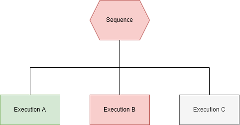
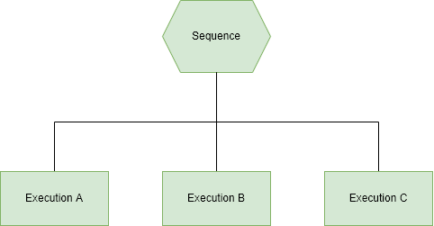
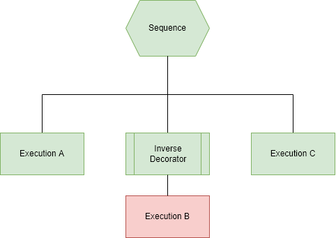

# BaseScript - Woodcutting

This script has been created using my own implementation of a Behaviour Tree (BT). A BT can be expressed as a hierarchal series of nodes *(Though in this repository, they derive from a base class called "Task")*. These nodes can be described as three types:

 1. **Control Flow** - *used to control which execution path to take down a tree.*
 2. **Execution** - *the "doers" of the script. These are your interactions with the game world*.
 3. **Decorator** - *a type of utility which "extends" or modifies the other node types*.

In this example script you will see all three types of nodes being used at some point.

## Why Behaviour trees?
### Reactivity
Why Behavior Trees? Behaviour trees are very "reactive" to changes in the game world. You're most likely currently writing scripts incorporating a **Finite State Machine** (FSM), which are usually excel at accomplishing small tasks with few states (think: WoodCuttingState and DroppingState or BankingState). Each state has a *finite* numbers of states it can switch or **transition** to. You usually have to do work up front to determine the triggers, and the implementation of this transition.

BTs on the other hand are written from the ground up around triggers in the game world, and if designed correctly, can handle transitions without any explicit code for them. If a random event was to spawn, or you were to enter combat, assuming a well structured tree, you can re-act (dismiss, run, or fight) without an explicit transition between states.

### Reusability
If nodes are carefully constructed , they can be re-used easily across scripts. As your node "library" increases, most of your time will end up designing your BTs and wiring up existing nodes.
Additionally, you will see in this example, I have created "Subtrees" which are a collection of nodes that can be re-used in a script, such as a Banking Subtree.
Typically BTs have an editor that will allow even non-programmers to be able to design these trees. The designing can be as granular as required - from dragging and dropping single nodes, or slotting in fully fledged pre-made subtrees.

### Adaptability
Similar in aspects to the reusability point above, BTs can be easily modified to tweak behaviours in given situations, or even expand to have other scenarios covered by a branch in the tree. This is especially apparent when using decorators to extend or modify the condition, or execution of a given node.

## Why not Behaviour Trees?
### Debugging
Debugging a BT can be tough. You don't have a state which you can easily identify an issue with, and you might not be totally sure which hierarchal route you took, or why a node acted as it did.
You'll notice I've included a flag which can be used to enable debug mode. This will verbosely print out which node is executing, it's result, and potentially any failure reasons. There's still room for improvement here.

### Performance
It's easy to build a complex tree, with nodes that have particularly complex conditions to check before executing. With a FSM you're detecting the well defined state changes, and executing pre-determined transitions.
There are methods of managing this however, and optimising your tree to keep performance quick. These are outside the scope of this document, but consider the arrangement of the tree's nodes, or in some cases adding "short circuiting" nodes that cause branches to fail fast.

## But I like states, can I still use a Behaviour Tree?
Sure, though if you are trying to accomplish a fairly simple or small task, a BT might not give you any tangible benefits. However, for more complex tasks, you can use a BT for your transitions. Your BT can simply be used to manage your transitions from one state to another. On each cycle of execution, evaluate the BT to get the current state, and then execute your code related to the state.

## How are the different node types used?
### Execution
An Execution node is the where the work of your tree takes place. These will carry out actions in the game world. For example, the [`WalkToTile`](./src/Tasks/Implementations/Movement/WalkToTile.java) task. This task will walk to a given world tile, returning success when the player arrives within `maxDistance` of the target tile.

These tasks should be designed to be modular, and re-useable where possible, to gain the reusability benefit of using BTs. The tasks may appear multiple times within a tree, though should be separate instances of the task, rather than sharing context with other parts of the tree.

### Control Flow
Control Flow nodes are used as their name suggests - they control the flow of execution through the tree. There are typically two types of control flow nodes - the Sequence and the Selector types.
#### Sequence
A Sequence node can be expressed as a logical AND operator. For this node to succeed, all of it's child nodes must also succeed. This is a short circuiting failure - as soon as a child node fails, the Sequence does. The following diagrams depict scenarios in which a sequence node will fail, or succeed:

  *A failed sequence node*
  
---

  

*A successful sequence node*

---

  

#### Selector
A Selector node can be expressed as a logical OR operator. Only a single child needs to succeed, however it will. The following diagrams depict scenarios in which a Selector will succeed or fail:

   *A failed Selector node*
  
---

  

*A successful Selector node*

---

  

### Decorators
Decorators are used in order to extend or change any given node, whether that be an Execution node, or a Control Flow node; you can even use Decorators to modify other Decorators! An example of a decorator node is the [CanExecuteOverrideDecorator](./src/Tasks/Decorators/CanExecuteOverrideDecorator.java). This decorator can been used to "override" the `CanExecute` condition on nodes, with a function specified in the constructor.
The following diagram depicts an Inverse Result Decorator node "wrapping" Execution B, turning it's failure result into a success:

